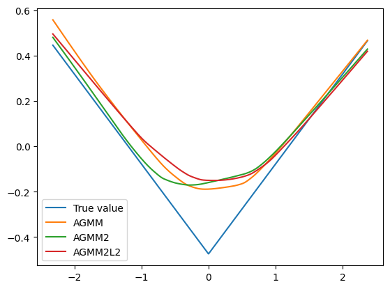
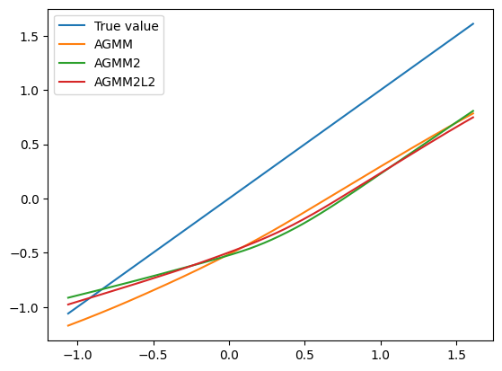

.. _longitudinal_notebook_agmm:

Longitudinal Notebook AGMM
==========================

.. code:: ipython3

    import os
    import numpy as np
    import pandas as pd
    
    import ivfunctions_nested 
    import mliv.dgps_nested as dgps
    import matplotlib.pyplot as plt
    
    import torch
    import torch.nn as nn
    from sklearn.cluster import KMeans
    #from mliv.neuralnet.deepiv_fit import deep_iv_fit
    from mliv.neuralnet.rbflayer import gaussian, inverse_multiquadric
    from mliv.neuralnet import AGMM, AGMM2, AGMM2L2
    from mliv.tsls import tsls, regtsls
    
    p = 0.1  # dropout prob of dropout layers throughout notebook
    n_hidden = 100  # width of hidden layers throughout notebook
    
    
    device = torch.cuda.current_device() if torch.cuda.is_available() else None

.. code:: ipython3

    fn_number = 0
    tau_fn = dgps.get_tau_fn(fn_number)

.. code:: ipython3

    A, D, B, C, Y, tau_fn = dgps.get_data(3000, 10, 10, tau_fn, 2)
    
    
    B_test = np.zeros((1000, B.shape[1]))
    B_test += np.median(B, axis=0, keepdims=True)
    B_test[:, 0] = np.linspace(np.percentile(B[:, 0], 5), np.percentile(B[:, 0], 95), 1000)
    
    B_test = B_test[np.argsort(B_test[:, 0])]
    true_fn = tau_fn(B_test)
    

.. code:: ipython3

    A_test = np.zeros((1000, A.shape[1]))
    A_test += np.median(A, axis=0, keepdims=True)
    A_test[:, 0] = np.linspace(np.percentile(A[:, 0], 5), np.percentile(A[:, 0], 95), 1000)
    
    A_test = A_test[np.argsort(A_test[:, 0])]
    true_fn_A = A_test[:, 0]

.. code:: ipython3

    def nested_npivfit(A, B, C, D, Y, B_test, A_test, model1, model2):
    
        B1_test = torch.Tensor(B_test)
        if A_test is not None:
            A1_test = torch.Tensor(A_test)
        Y = torch.Tensor(Y)
        A1 = torch.Tensor(A)
        B1 = torch.Tensor(B)
        A2 = torch.Tensor(D)
        B2 = torch.Tensor(C)
    
        #First stage
        m1 = model1.fit(A2, A1, Y, n_epochs=150)
        bridge_fs = torch.Tensor(m1.predict(A1.to(device)))
        
        #Second stage
        m2 = model2.fit(B2, B1, bridge_fs,n_epochs=150)
        y_pred = m2.predict(B1_test.to(device))
        
    
        return y_pred.reshape(B1_test.shape[:1] + Y.shape[1:]), m1.predict(A1_test.to(device)).reshape(A1_test.shape[:1] + Y.shape[1:])
    
.. code:: ipython3

    def _get_learner(n_t):
        return nn.Sequential(nn.Dropout(p=p), nn.Linear(n_t, n_hidden), nn.LeakyReLU(),
                             nn.Dropout(p=p), nn.Linear(n_hidden, 1))
    
    
    def _get_adversary(n_z):
        return nn.Sequential(nn.Dropout(p=p), nn.Linear(n_z, n_hidden), nn.LeakyReLU(),
                             nn.Dropout(p=p), nn.Linear(n_hidden, 1))

.. code:: ipython3

    agmm_1 = AGMM(_get_learner(A.shape[1]),_get_adversary(D.shape[1]))
    agmm_2 = AGMM(_get_learner(B.shape[1]),_get_adversary(C.shape[1]))

.. code:: ipython3

    agmm_pred, agmm_pred_g = nested_npivfit(A, B, C, D, Y, B_test, A_test, model1=agmm_1, model2=agmm_2)

.. code:: ipython3

    n_hidden = 100  # width of hidden layers throughout notebook
    
    agmm2_model = AGMM2(learnerh = _get_learner(B.shape[1]), learnerg = _get_learner(A.shape[1]),
                         adversary1 = _get_adversary(D.shape[1]), adversary2 = _get_adversary(C.shape[1]))
    
    
    A = torch.tensor(A, dtype=torch.float32)
    D = torch.tensor(D, dtype=torch.float32)
    B = torch.tensor(B, dtype=torch.float32)
    C = torch.tensor(C, dtype=torch.float32)
    Y = torch.tensor(Y, dtype=torch.float32)
    B_test = torch.tensor(B_test, dtype=torch.float32)
    A_test = torch.tensor(A_test, dtype=torch.float32)
    agmm2_pred,agmm2_pred_g = agmm2_model.fit(A, B, C, D, Y, n_epochs=300).predict(B_test.to(device), A_test.to(device))

.. code:: ipython3

    n_hidden = 100  # width of hidden layers throughout notebook
    
    agmm2l2_model = AGMM2L2(learnerh = _get_learner(B.shape[1]), learnerg = _get_learner(A.shape[1]),
                         adversary1 = _get_adversary(D.shape[1]), adversary2 = _get_adversary(C.shape[1]))
    
    
    A = A.clone().detach().float()
    D = D.clone().detach().float()
    B = B.clone().detach().float()
    C = C.clone().detach().float()
    Y = Y.clone().detach().float()
    B_test = B_test.clone().detach().float()
    A_test = A_test.clone().detach().float()
    agmm2l2_pred,agmm2l2_pred_g = agmm2_model.fit(A, B, C, D, Y, n_epochs=300).predict(B_test.to(device), A_test.to(device))

.. code:: ipython3

    plt.plot(B_test[:, 0], true_fn, label='True value')
    plt.plot(B_test[:, 0], agmm_pred, label='AGMM')
    plt.plot(B_test[:, 0], agmm2_pred, label='AGMM2')
    plt.plot(B_test[:, 0], agmm2l2_pred, label='AGMM2L2')
    plt.legend()

.. parsed-literal::

    <matplotlib.legend.Legend at 0x272deb991f0>

.. code:: ipython3

    plt.plot(A_test[:, 0], true_fn_A, label='True value')
    plt.plot(A_test[:, 0], agmm_pred_g, label='AGMM')
    plt.plot(A_test[:, 0], agmm2_pred_g, label='AGMM2')
    plt.plot(A_test[:, 0], agmm2l2_pred_g, label='AGMM2L2')
    plt.legend()

.. parsed-literal::

    <matplotlib.legend.Legend at 0x272df73a4c0>

