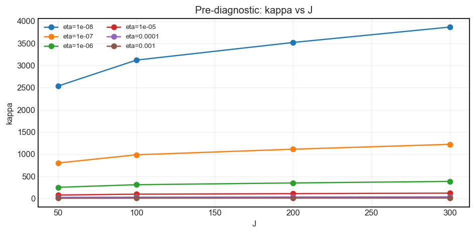
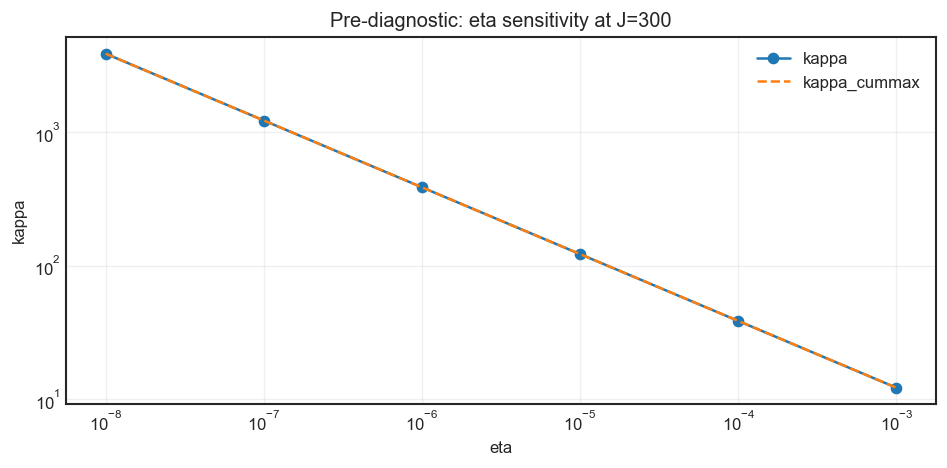
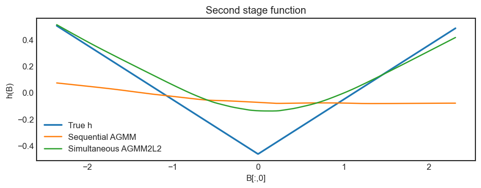
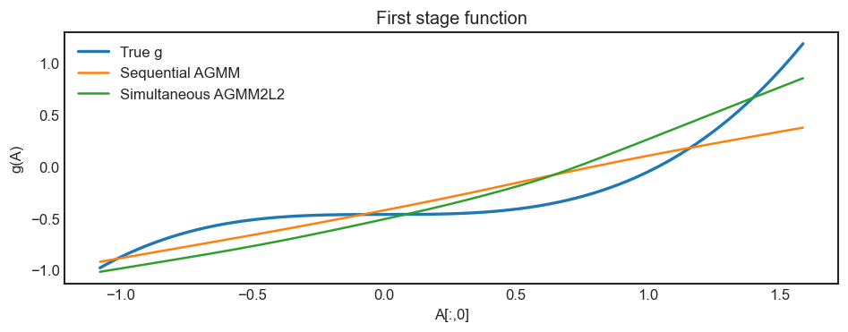
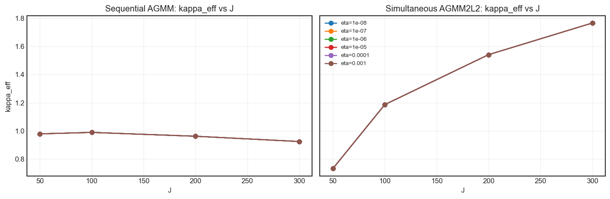
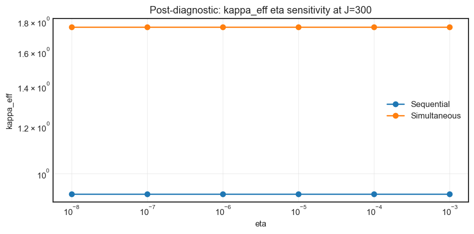

.. _longitudinal_notebook_agmm:

Longitudinal AGMM Notebook: Direct NNPIV Pipeline + Diagnostics
===============================================================

This notebook is a direct, minimal working example (no training
wrappers) showing:

1. Data generation and true targets (``g0``, ``h0``)
2. Pre-estimation Diagnostic A (``kappa``) and divergence check over
   ``J`` and ``eta``
3. Sequential AGMM and simultaneous AGMM2L2 fits (explicit syntax)
4. First- and second-stage function plots
5. Post-estimation effective-kappa comparison (``kappa_eff``) for
   sequential vs simultaneous

1) Imports and setup
--------------------

.. code-block:: python

    import os
    import sys
    from pathlib import Path

    import numpy as np
    import pandas as pd
    import matplotlib.pyplot as plt

    # Thread controls for stable local runs
    os.environ.setdefault("OMP_NUM_THREADS", "1")
    os.environ.setdefault("OPENBLAS_NUM_THREADS", "1")
    os.environ.setdefault("MKL_NUM_THREADS", "1")
    os.environ.setdefault("VECLIB_MAXIMUM_THREADS", "1")
    os.environ.setdefault("NUMEXPR_NUM_THREADS", "1")

    def seed_everything(seed: int = 123) -> None:
        import random
        import torch
        random.seed(seed)
        np.random.seed(seed)
        torch.manual_seed(seed)
        if torch.cuda.is_available():
            torch.cuda.manual_seed_all(seed)

    seed_everything(123)

    NOTEBOOK_DIR = Path.cwd()
    REPO_ROOT = NOTEBOOK_DIR
    if not (REPO_ROOT / "nnpiv").exists():
        REPO_ROOT = NOTEBOOK_DIR.parent.parent
    if not (REPO_ROOT / "nnpiv").exists():
        raise RuntimeError("Could not resolve repo root containing nnpiv.")

    if str(REPO_ROOT) not in sys.path:
        sys.path.insert(0, str(REPO_ROOT))
    if str(REPO_ROOT / "simulations") not in sys.path:
        sys.path.insert(0, str(REPO_ROOT / "simulations"))

    import dgps_nested as dgps

    import torch
    import torch.nn as nn
    from nnpiv.neuralnet import AGMM, AGMM2L2
    from nnpiv.diagnostics import (
        relative_wellposedness_from_nested_npiv,
        relative_wellposedness_sieve_from_nested_npiv,
        relative_wellposedness_effective_sieve_from_nested_npiv,
    )

    DEVICE = torch.device("cuda") if torch.cuda.is_available() else torch.device("cpu")
    plt.style.use("seaborn-v0_8-white")
    plt.rcParams["figure.dpi"] = 120

    try:
        torch.set_num_threads(1)
        torch.set_num_interop_threads(1)
    except Exception:
        pass

2) Helper builders
------------------

.. code-block:: python

    p_dropout = 0.10
    n_hidden = 100

    def get_learner(n_t: int) -> nn.Module:
        return nn.Sequential(
            nn.Dropout(p=p_dropout),
            nn.Linear(n_t, n_hidden),
            nn.LeakyReLU(),
            nn.Dropout(p=p_dropout),
            nn.Linear(n_hidden, 1),
        )

    def get_adversary(n_z: int) -> nn.Module:
        return nn.Sequential(
            nn.Dropout(p=p_dropout),
            nn.Linear(n_z, n_hidden),
            nn.LeakyReLU(),
            nn.Dropout(p=p_dropout),
            nn.Linear(n_hidden, 1),
        )

    def make_test_grid(X: np.ndarray, var_idx: int = 0, n: int = 1000, q_low: float = 5.0, q_high: float = 95.0) -> np.ndarray:
        grid = np.tile(np.median(X, axis=0, keepdims=True), (n, 1))
        grid[:, var_idx] = np.linspace(np.percentile(X[:, var_idx], q_low), np.percentile(X[:, var_idx], q_high), n)
        return grid[np.argsort(grid[:, var_idx])]

3) Data generation (original DGP configuration)
-----------------------------------------------

.. code-block:: python

    # =========================================================
    # Data generation
    # =========================================================
    # Function dictionary (for reference):
    # {'abs': 0, '2dpoly': 1, 'sigmoid': 2, 'sin': 3, 'frequent_sin': 4, 'abs_sqrt': 5,
    #  'step': 6, '3dpoly': 7, 'linear': 8, 'rand_pw': 9, 'abspos': 10, 'sqrpos': 11,
    #  'band': 12, 'invband': 13, 'steplinear': 14, 'pwlinear': 15, 'exponential': 16}

    fn_number = 0
    raw_tau_fn = dgps.get_tau_fn(fn_number)

    # A, D are first stage (endog + instruments); B, C are second stage; Y is outcome
    A, D, B, C, Y, truth = dgps.get_data(
        3000, 10, 10, raw_tau_fn, 2, return_truth=True
    )

    B_test = make_test_grid(B, var_idx=0, n=1000, q_low=5, q_high=95)
    A_test = make_test_grid(A, var_idx=0, n=1000, q_low=5, q_high=95)

    # Standardized truth functions used for plots / effective-kappa error direction
    h0_B_test = np.asarray(truth.h(B_test)).reshape(-1)
    g0_A_test = np.asarray(truth.g(A_test)).reshape(-1)
    g0_A_train = np.asarray(truth.g(A)).reshape(-1)

    print("Shapes:", A.shape, D.shape, B.shape, C.shape, Y.shape)

.. parsed-literal::

    Shapes: (3000, 10) (3000, 10) (3000, 10) (3000, 10) (3000, 1)

4) Pre-estimation diagnostics (Diagnostic A)
--------------------------------------------

.. code-block:: python

    # Explicit diagnostic options
    feature_map = "rff"
    sieve_grid = [50, 100, 200, 300]
    eta_grid = [1e-3, 1e-4, 1e-5, 1e-6, 1e-7, 1e-8]
    eta_mode = "sigma_i"
    ridge_alpha = 1.0
    random_state = 123

    # Point diagnostic at largest J / smallest eta
    diag_point = relative_wellposedness_from_nested_npiv(
        A=A,
        D=D,
        B=B,
        C=C,
        feature_map=feature_map,
        n_features=max(sieve_grid),
        eta=min(eta_grid),
        eta_mode=eta_mode,
        ridge_alpha=ridge_alpha,
        random_state=random_state,
    )

    # Sieve diagnostic across J and eta
    diag_sieve = relative_wellposedness_sieve_from_nested_npiv(
        A=A,
        D=D,
        B=B,
        C=C,
        feature_map=feature_map,
        sieve_grid=sieve_grid,
        eta_grid=eta_grid,
        eta_mode=eta_mode,
        ridge_alpha=ridge_alpha,
        random_state=random_state,
        enforce_nested_rff=True,
    )

    # Robust extraction (works even if some keys are unavailable in older diagnostics builds)
    pre_point_df = pd.DataFrame([
        {
            "kappa": diag_point.get("kappa", np.nan),
            "kappa2": diag_point.get("kappa2", np.nan),
            "nullspace_violation_flag": diag_point.get("nullspace_violation_flag", False),
            "nullspace_leakage": diag_point.get("nullspace_leakage_sigma_t_on_null_sigma_s", np.nan),
            "stabilization_dominance_ratio": diag_point.get("stabilization_dominance_ratio", np.nan),
            "max_diag_ratio": diag_point.get("max_diag_ratio_sigma_t_over_sigma_s", np.nan),
        }
    ])

    display(pre_point_df.round(6))

    pre_sieve_df = pd.DataFrame(diag_sieve["rows"]).sort_values(["eta", "sieve_value"]).reset_index(drop=True)
    pre_sieve_df = pre_sieve_df.rename(columns={"sieve_value": "J"})
    for maybe_col, fallback in [
        ("nullspace_violation_flag", False),
        ("nullspace_leakage_sigma_t_on_null_sigma_s", np.nan),
        ("stabilization_dominance_ratio", np.nan),
        ("kappa_cummax", np.nan),
    ]:
        if maybe_col not in pre_sieve_df.columns:
            pre_sieve_df[maybe_col] = fallback

    pre_eta_summary = (
        pre_sieve_df.groupby("eta", as_index=False)
        .agg(
            mean_kappa=("kappa", "mean"),
            max_kappa=("kappa", "max"),
            any_nullspace_violation=("nullspace_violation_flag", "max"),
            mean_nullspace_leakage=("nullspace_leakage_sigma_t_on_null_sigma_s", "mean"),
            mean_stab_dom_ratio=("stabilization_dominance_ratio", "mean"),
        )
        .sort_values("eta")
    )

    display(pre_eta_summary.round(6))

.. raw:: html

    

    
    <table border="1" class="dataframe">
      <thead>
        <tr style="text-align: right;">
          <th></th>
          <th>kappa</th>
          <th>kappa2</th>
          <th>nullspace_violation_flag</th>
          <th>nullspace_leakage</th>
          <th>stabilization_dominance_ratio</th>
          <th>max_diag_ratio</th>
        </tr>
      </thead>
      <tbody>
        <tr>
          <th>0</th>
          <td>3868.804021</td>
          <td>1.496764e+07</td>
          <td>True</td>
          <td>0.002695</td>
          <td>0.0</td>
          <td>4.513571</td>
        </tr>
      </tbody>
    </table>
    

.. raw:: html

    

    
    <table border="1" class="dataframe">
      <thead>
        <tr style="text-align: right;">
          <th></th>
          <th>eta</th>
          <th>mean_kappa</th>
          <th>max_kappa</th>
          <th>any_nullspace_violation</th>
          <th>mean_nullspace_leakage</th>
          <th>mean_stab_dom_ratio</th>
        </tr>
      </thead>
      <tbody>
        <tr>
          <th>0</th>
          <td>0.000000</td>
          <td>3262.802329</td>
          <td>3868.804021</td>
          <td>True</td>
          <td>0.001398</td>
          <td>0.000000</td>
        </tr>
        <tr>
          <th>1</th>
          <td>0.000000</td>
          <td>1031.786043</td>
          <td>1223.412196</td>
          <td>True</td>
          <td>0.001398</td>
          <td>0.000000</td>
        </tr>
        <tr>
          <th>2</th>
          <td>0.000001</td>
          <td>326.279775</td>
          <td>386.876935</td>
          <td>True</td>
          <td>0.001398</td>
          <td>0.000001</td>
        </tr>
        <tr>
          <th>3</th>
          <td>0.000010</td>
          <td>103.179945</td>
          <td>122.341466</td>
          <td>True</td>
          <td>0.001398</td>
          <td>0.000013</td>
        </tr>
        <tr>
          <th>4</th>
          <td>0.000100</td>
          <td>32.632218</td>
          <td>38.688515</td>
          <td>True</td>
          <td>0.001398</td>
          <td>0.000134</td>
        </tr>
        <tr>
          <th>5</th>
          <td>0.001000</td>
          <td>10.331198</td>
          <td>12.236727</td>
          <td>True</td>
          <td>0.001398</td>
          <td>0.001343</td>
        </tr>
      </tbody>
    </table>
    

.. code-block:: python

    # Plot 1: kappa vs J for each eta
    fig, ax = plt.subplots(figsize=(8, 4))
    for eta in sorted(pre_sieve_df["eta"].unique()):
        g = pre_sieve_df[pre_sieve_df["eta"] == eta].sort_values("J")
        ax.plot(g["J"], g["kappa"], marker="o", label=f"eta={eta:g}")
    ax.set_title("Pre-diagnostic: kappa vs J")
    ax.set_xlabel("J")
    ax.set_ylabel("kappa")
    ax.grid(alpha=0.3)
    ax.legend(frameon=False, fontsize=8, ncol=2)
    plt.tight_layout()
    plt.show()

    # Plot 2: eta sensitivity at largest J
    J_star = max(sieve_grid)
    eta_slice = pre_sieve_df[pre_sieve_df["J"] == J_star].sort_values("eta")

    fig, ax = plt.subplots(figsize=(8, 4))
    ax.plot(eta_slice["eta"], eta_slice["kappa"], marker="o", label="kappa")
    if eta_slice["kappa_cummax"].notna().any():
        ax.plot(eta_slice["eta"], eta_slice["kappa_cummax"], "--", label="kappa_cummax")
    ax.set_xscale("log")
    ax.set_yscale("log")
    ax.set_title(f"Pre-diagnostic: eta sensitivity at J={J_star}")
    ax.set_xlabel("eta")
    ax.set_ylabel("kappa")
    ax.grid(alpha=0.3)
    ax.legend(frameon=False)
    plt.tight_layout()
    plt.show()

5) Sequential AGMM fit
----------------------

.. code-block:: python

    fitargs_seq = dict(
        n_epochs=150,
        bs=256,
        learner_lr=1e-4,
        adversary_lr=1e-4,
        learner_l2=1e-3,
        adversary_l2=1e-4,
    )

    # Build models
    agmm_stage1 = AGMM(get_learner(A.shape[1]), get_adversary(D.shape[1]))  # first stage
    agmm_stage2 = AGMM(get_learner(B.shape[1]), get_adversary(C.shape[1]))  # second stage

    # Tensor conversion
    A_t = torch.as_tensor(A, dtype=torch.float32, device=DEVICE)
    B_t = torch.as_tensor(B, dtype=torch.float32, device=DEVICE)
    C_t = torch.as_tensor(C, dtype=torch.float32, device=DEVICE)
    D_t = torch.as_tensor(D, dtype=torch.float32, device=DEVICE)
    Y_t = torch.as_tensor(Y, dtype=torch.float32, device=DEVICE)
    A_test_t = torch.as_tensor(A_test, dtype=torch.float32, device=DEVICE)
    B_test_t = torch.as_tensor(B_test, dtype=torch.float32, device=DEVICE)

    # First stage: fit g using (D, A, Y)
    agmm_stage1.fit(D_t, A_t, Y_t, device=DEVICE, **fitargs_seq)
    g_hat_A_train_seq = np.asarray(agmm_stage1.predict(A_t)).reshape(-1)
    g_hat_A_test_seq = np.asarray(agmm_stage1.predict(A_test_t)).reshape(-1)

    # Second stage: fit h using (C, B, target=g_hat_A_train)
    g_hat_A_train_seq_t = torch.as_tensor(g_hat_A_train_seq.reshape(-1, 1), dtype=torch.float32, device=DEVICE)
    agmm_stage2.fit(C_t, B_t, g_hat_A_train_seq_t, device=DEVICE, **fitargs_seq)
    h_hat_B_test_seq = np.asarray(agmm_stage2.predict(B_test_t)).reshape(-1)

    print("Sequential AGMM fit done.")

.. parsed-literal::

    Sequential AGMM fit done.

6) Simultaneous AGMM2L2 fit
---------------------------

.. code-block:: python

    n_epochs_sim = 350

    agmm2l2_model = AGMM2L2(
        learnerh=get_learner(B.shape[1]),
        learnerg=get_learner(A.shape[1]),
        adversary1=get_adversary(D.shape[1]),
        adversary2=get_adversary(C.shape[1]),
    )

    agmm2l2_model.fit(A_t, B_t, C_t, D_t, Y_t, n_epochs=n_epochs_sim, device=DEVICE)

    # Test predictions
    h_hat_B_test_sim, g_hat_A_test_sim = agmm2l2_model.predict(B_test_t, A_test_t)
    h_hat_B_test_sim = np.asarray(h_hat_B_test_sim).reshape(-1)
    g_hat_A_test_sim = np.asarray(g_hat_A_test_sim).reshape(-1)

    # Train-A predictions for post-diagnostic e_g
    a_dummy_h_train, g_hat_A_train_sim = agmm2l2_model.predict(B_t, A_t)
    g_hat_A_train_sim = np.asarray(g_hat_A_train_sim).reshape(-1)

    print("Simultaneous AGMM2L2 fit done.")

.. parsed-literal::

    Simultaneous AGMM2L2 fit done.

7) Stage plots and RMSE summary
-------------------------------

.. code-block:: python

    # Second stage h(B)
    plt.figure(figsize=(8, 3.2))
    plt.plot(B_test[:, 0], h0_B_test, label="True h", linewidth=2)
    plt.plot(B_test[:, 0], h_hat_B_test_seq, label="Sequential AGMM")
    plt.plot(B_test[:, 0], h_hat_B_test_sim, label="Simultaneous AGMM2L2")
    plt.xlabel("B[:,0]")
    plt.ylabel("h(B)")
    plt.title("Second stage function")
    plt.legend(frameon=False)
    plt.tight_layout()
    plt.show()

    # First stage g(A)
    plt.figure(figsize=(8, 3.2))
    plt.plot(A_test[:, 0], g0_A_test, label="True g", linewidth=2)
    plt.plot(A_test[:, 0], g_hat_A_test_seq, label="Sequential AGMM")
    plt.plot(A_test[:, 0], g_hat_A_test_sim, label="Simultaneous AGMM2L2")
    plt.xlabel("A[:,0]")
    plt.ylabel("g(A)")
    plt.title("First stage function")
    plt.legend(frameon=False)
    plt.tight_layout()
    plt.show()

    rmse_df = pd.DataFrame([
        {
            "estimator": "sequential_agmm",
            "rmse_h_test": float(np.sqrt(np.mean((h_hat_B_test_seq - h0_B_test) ** 2))),
            "rmse_g_test": float(np.sqrt(np.mean((g_hat_A_test_seq - g0_A_test) ** 2))),
        },
        {
            "estimator": "simultaneous_agmm2l2",
            "rmse_h_test": float(np.sqrt(np.mean((h_hat_B_test_sim - h0_B_test) ** 2))),
            "rmse_g_test": float(np.sqrt(np.mean((g_hat_A_test_sim - g0_A_test) ** 2))),
        },
    ])

    display(rmse_df.round(6))

.. raw:: html

    

    
    <table border="1" class="dataframe">
      <thead>
        <tr style="text-align: right;">
          <th></th>
          <th>estimator</th>
          <th>rmse_h_test</th>
          <th>rmse_g_test</th>
        </tr>
      </thead>
      <tbody>
        <tr>
          <th>0</th>
          <td>sequential_agmm</td>
          <td>0.265000</td>
          <td>0.225919</td>
        </tr>
        <tr>
          <th>1</th>
          <td>simultaneous_agmm2l2</td>
          <td>0.132396</td>
          <td>0.210635</td>
        </tr>
      </tbody>
    </table>
    

8) Post-estimation effective-kappa (``kappa_eff``) for ``g``
------------------------------------------------------------

.. code-block:: python

    # Error directions on train sample
    e_g_seq = g_hat_A_train_seq - g0_A_train
    e_g_sim = g_hat_A_train_sim - g0_A_train

    post_seq = relative_wellposedness_effective_sieve_from_nested_npiv(
        A=A,
        D=D,
        B=B,
        C=C,
        e_g=e_g_seq,
        feature_map=feature_map,
        sieve_grid=sieve_grid,
        eta_grid=eta_grid,
        eta_mode=eta_mode,
        ridge_alpha=ridge_alpha,
        random_state=random_state,
        enforce_nested_rff=True,
    )

    post_sim = relative_wellposedness_effective_sieve_from_nested_npiv(
        A=A,
        D=D,
        B=B,
        C=C,
        e_g=e_g_sim,
        feature_map=feature_map,
        sieve_grid=sieve_grid,
        eta_grid=eta_grid,
        eta_mode=eta_mode,
        ridge_alpha=ridge_alpha,
        random_state=random_state,
        enforce_nested_rff=True,
    )

    post_seq_df = pd.DataFrame(post_seq["rows"]).rename(columns={"sieve_value": "J"})
    post_seq_df["estimator"] = "sequential_agmm"
    post_sim_df = pd.DataFrame(post_sim["rows"]).rename(columns={"sieve_value": "J"})
    post_sim_df["estimator"] = "simultaneous_agmm2l2"

    post_df = pd.concat([post_seq_df, post_sim_df], ignore_index=True)
    if "kappa_eff_cummax" not in post_df.columns:
        post_df["kappa_eff_cummax"] = np.nan

    summary_post = (
        post_df.groupby("estimator", as_index=False)
        .agg(
            mean_kappa_eff=("kappa_eff", "mean"),
            max_kappa_eff=("kappa_eff", "max"),
            max_kappa_eff_cummax=("kappa_eff_cummax", "max"),
        )
    )

    eta_min = min(eta_grid)
    J_max = max(sieve_grid)
    endpoint = post_df[(post_df["eta"] == eta_min) & (post_df["J"] == J_max)][["estimator", "kappa_eff"]]
    endpoint = endpoint.rename(columns={"kappa_eff": "kappa_eff_at_smallest_eta_largest_J"})
    summary_post = summary_post.merge(endpoint, on="estimator", how="left")

    display(summary_post.round(6))

.. raw:: html

    

    
    <table border="1" class="dataframe">
      <thead>
        <tr style="text-align: right;">
          <th></th>
          <th>estimator</th>
          <th>mean_kappa_eff</th>
          <th>max_kappa_eff</th>
          <th>max_kappa_eff_cummax</th>
          <th>kappa_eff_at_smallest_eta_largest_J</th>
        </tr>
      </thead>
      <tbody>
        <tr>
          <th>0</th>
          <td>sequential_agmm</td>
          <td>0.963738</td>
          <td>0.989240</td>
          <td>0.989240</td>
          <td>0.924622</td>
        </tr>
        <tr>
          <th>1</th>
          <td>simultaneous_agmm2l2</td>
          <td>1.306638</td>
          <td>1.766061</td>
          <td>1.766061</td>
          <td>1.766061</td>
        </tr>
      </tbody>
    </table>
    

.. code-block:: python

    # Side-by-side kappa_eff vs J by eta
    fig, axes = plt.subplots(1, 2, figsize=(12, 4), sharey=True)
    for ax, est_name, title in [
        (axes[0], "sequential_agmm", "Sequential AGMM"),
        (axes[1], "simultaneous_agmm2l2", "Simultaneous AGMM2L2"),
    ]:
        sub = post_df[post_df["estimator"] == est_name]
        for eta in sorted(sub["eta"].unique()):
            g = sub[sub["eta"] == eta].sort_values("J")
            ax.plot(g["J"], g["kappa_eff"], marker="o", label=f"eta={eta:g}")
        ax.set_title(f"{title}: kappa_eff vs J")
        ax.set_xlabel("J")
        ax.grid(alpha=0.3)
    axes[0].set_ylabel("kappa_eff")
    axes[1].legend(frameon=False, fontsize=8)
    plt.tight_layout()
    plt.show()

    # Optional eta sensitivity at largest J
    fig, ax = plt.subplots(figsize=(8, 4))
    for est_name, label in [
        ("sequential_agmm", "Sequential"),
        ("simultaneous_agmm2l2", "Simultaneous"),
    ]:
        g = post_df[(post_df["estimator"] == est_name) & (post_df["J"] == J_max)].sort_values("eta")
        ax.plot(g["eta"], g["kappa_eff"], marker="o", label=label)
    ax.set_xscale("log")
    ax.set_yscale("log")
    ax.set_title(f"Post-diagnostic: kappa_eff eta sensitivity at J={J_max}")
    ax.set_xlabel("eta")
    ax.set_ylabel("kappa_eff")
    ax.grid(alpha=0.3)
    ax.legend(frameon=False)
    plt.tight_layout()
    plt.show()

9) Compact readout
------------------

.. code-block:: python

    # Pre-diagnostic divergence heuristic
    eta_slice = pre_sieve_df[pre_sieve_df["J"] == J_star].sort_values("eta")
    kappa_small_eta = float(eta_slice.iloc[0]["kappa"])
    kappa_large_eta = float(eta_slice.iloc[-1]["kappa"])
    ratio_small_over_large = kappa_small_eta / max(kappa_large_eta, 1e-12)
    any_null_violation = bool(pre_sieve_df["nullspace_violation_flag"].astype(bool).any())
    pre_divergence_risk = any_null_violation or (ratio_small_over_large > 5.0)

    end_seq = float(summary_post.loc[summary_post["estimator"] == "sequential_agmm", "kappa_eff_at_smallest_eta_largest_J"].iloc[0])
    end_sim = float(summary_post.loc[summary_post["estimator"] == "simultaneous_agmm2l2", "kappa_eff_at_smallest_eta_largest_J"].iloc[0])

    if end_seq > end_sim:
        larger_eff = "Sequential"
    elif end_sim > end_seq:
        larger_eff = "Simultaneous"
    else:
        larger_eff = "Tie"

    print("Readout:")
    print(f"- Pre-diagnostic divergence-risk flag: {pre_divergence_risk}")
    print(f"  (nullspace_violation_any={any_null_violation}, kappa_small_eta/kappa_large_eta={ratio_small_over_large:.3f})")
    print(f"- Larger effective-kappa at smallest eta and largest J: {larger_eff}")
    print(f"  (Sequential={end_seq:.6f}, Simultaneous={end_sim:.6f})")

.. parsed-literal::

    Readout:
    - Pre-diagnostic divergence-risk flag: True
      (nullspace_violation_any=True, kappa_small_eta/kappa_large_eta=316.163)
    - Larger effective-kappa at smallest eta and largest J: Simultaneous
      (Sequential=0.924622, Simultaneous=1.766061)
